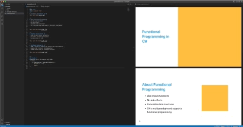

# Marplate
*A Minimalist Slide/Presentation Template*

Marplate is for developers (or anyone else) who dislike using tools like PowerPoint for presentations and just want to stick with the tools they already know and love.  It's a markdown-based slide template optimized for use with VS Code (or the editor of your choice… hullo VI). Built on the [Marp Presentation Ecosystem](https://marp.app/) and the [.NET Core Template Engine](https://github.com/dotnet/templating/), Marplate is a minimalist solution that simplifies formatting and layout, so you can focus on creating beautiful presentations. 



## Requirements
- .Net 6 or better
- VS Code or editor of your choice
- Marp extension for VS Code

## Installing with the .Net Core Template Engine
To install the template for use with the template engine, clone the repository and execute the following commands:
```console
  cd marplate/src
  dotnet pack -c Release
  dotnet new install bin/Release/Marplate.1.0.0.nupkg
```

## Creating a New Presentation
To create a new presentation execute:
```console
   dotnet new marplate --name <presentation>
```

Open VS Code and enjoy a life free of PowerPoint :)

## Configuring Theme from the Command Line
The primary, secondary and tertiary colors can be configured from the command line:

```console
   dotnet new marplate --name mypresentation -p #000000 -s #555555 -te #CCCCCC
```

## VS Code Slide Templates
Several templates are provided for quickly adding slides to a presentation:

|  Name  | Command   | Result    |   
|--------|-----------|-----------|
| Basic Slide | `slide` |  Inserts a slide with heading and two columns, text on the left and an image on the right. |
| Title Slide | `title` |  Inserts a title slide with title text to the left and a main image to the right. |
| Code Slide | `code` | Inserts a slide with a heading, description and a section of code. |
| Blank Slide | `blank` | Inserts a blank slide. |


## Usage Example: Basic Slide
This example demonstrates how to insert a two column slide containing a heading, supporting text and an image.

 ```console
   ---
   # My heading
   Some text here
   and here
   and here
   
 ```
 
This slide template is accessible in VS Code by typing `slide` in the editor and selecting `Basic Slide` 

## Creating PDF, PowerPoint or HTML Slide Decks from VS Code
The Marp extension in VS Code allows you to export Marplate slides as PDF, Powerpoint or HTML slide decks.
From the Command Pallete choose `Marp: Export Slide Deck...` and choose the desired format.
